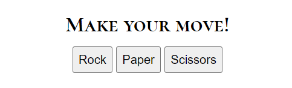
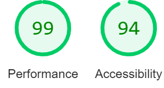

# Rock, Paper , Scissors
This website is made for the purpose of simple rock, paper, scissors game. To those unfamiliar with what this game is about, it is a playful, easy game often used in light-hearted decision making. The game is played by two people  making a sign of either a rock, paper and scissors with their fingers,where rock tramps scissors,scissors tramp paper,and paper tramps rock. 

## Features

### Header
- The header shows the name of the game.

### The Game Options
- The game options are preceded by the headline **Make your move!** to instruct the user that it is with those buttons they choose the option they want.
- The buttons are interactive elements that the user can press to play the game. 

### The result 
- When the user presses a button of their choice, the image corresponding to their choice is shown under the headline **Your turn...**. 
- The computer (JavaScript code) simultaneously generates a random choice, then displaying the image and then determines the winner.
- The JavaScript code announces to the user whether they lost or won by the sentence placed above the boards. 
- Score is updated accordingly. 

    

### Footer
- Footer contains  the explanation of game rules to the user.
- This is valuable to the user that is not familiar with the game before because it explains the game clearly.

    

### Features to implement in the future
- I would like to incorporate the result sentence with the rules of the game such that the game would say something like **Paper covers rock, you lost!**.

## Testing 
- I tested the game on chrome and edge. 
- I confirmed that the game results are correct.
- I confirmed that the game meets accessibility guidelines.

    
